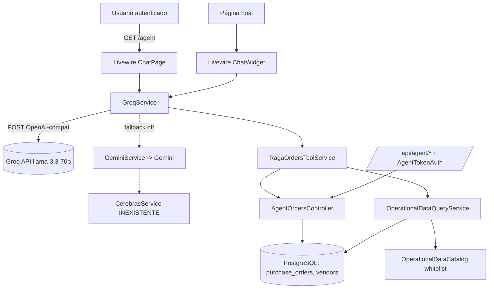
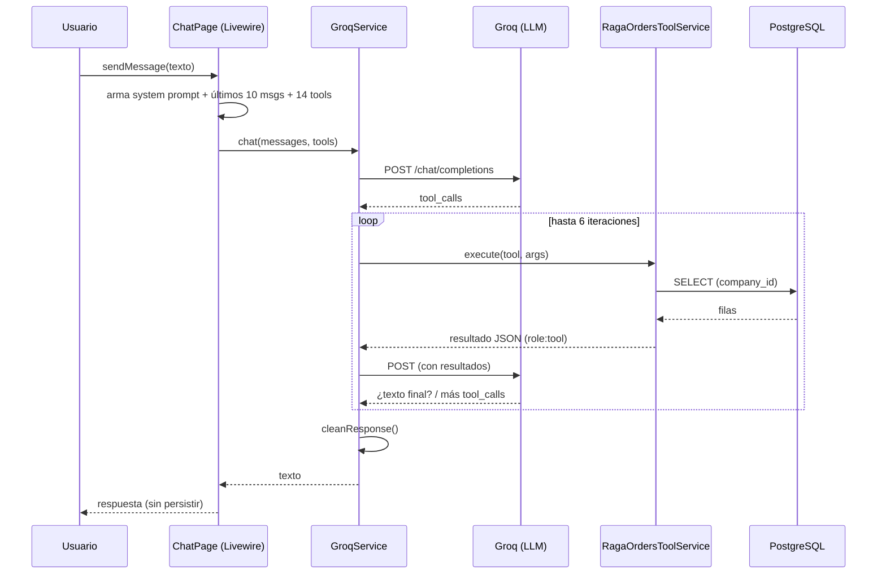
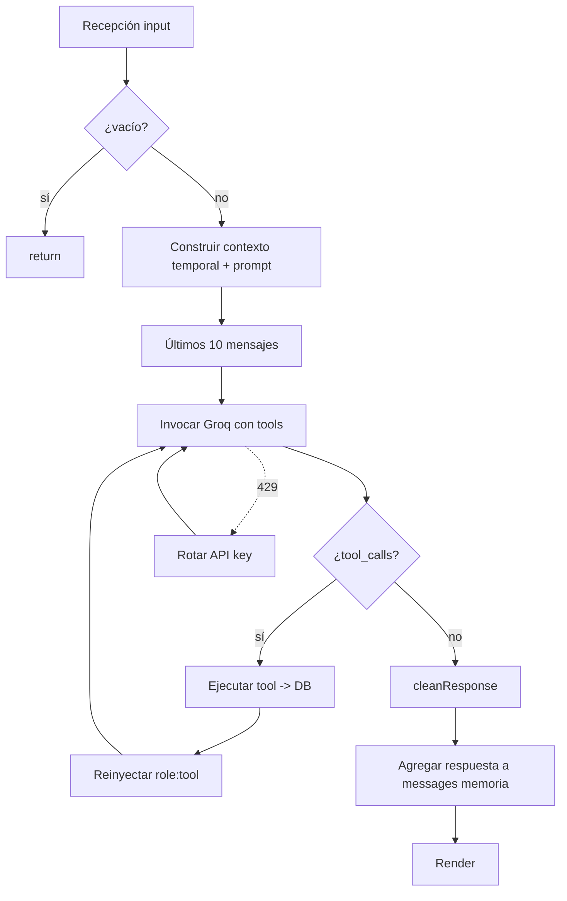
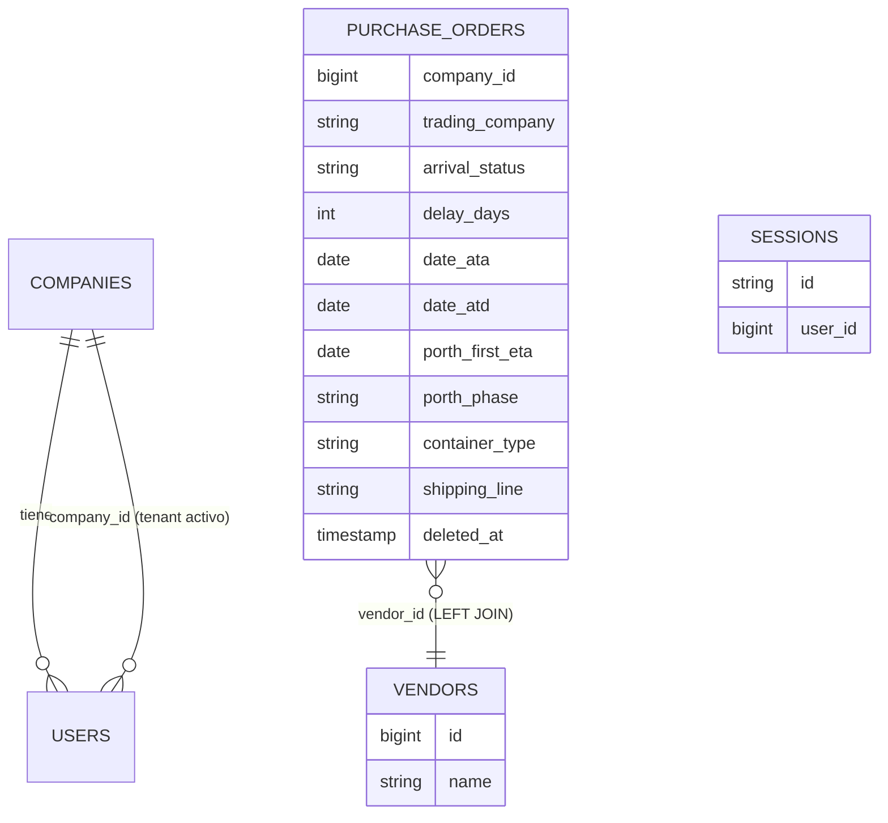
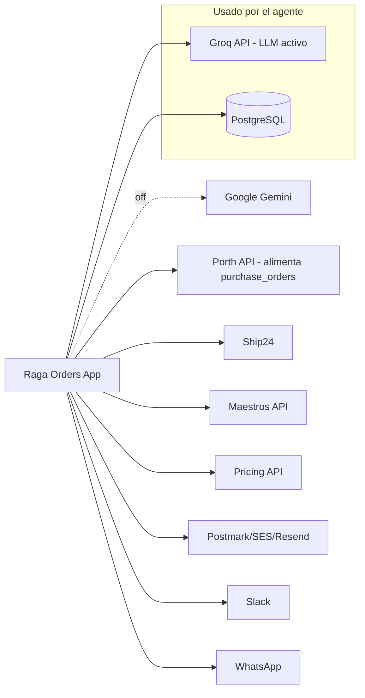
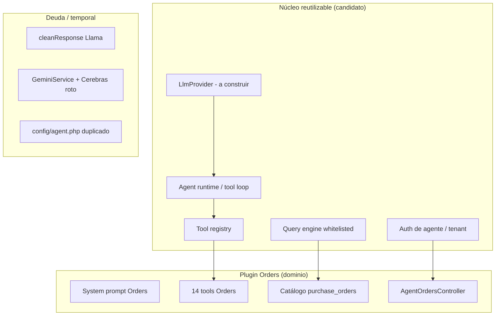

# Auditoría Técnica de Arquitectura — Agente IA de Orders ("RAGA-x")

**Repositorio:** `danielnucleofactory/agente-ai-orders`
**Rama auditada:** `develop` (el agente **no** está mergeado a `main`)
**Rama de trabajo:** `claude/orders-agent-migration-analysis-k50at6` (basada en `develop`)
**Fecha:** 2026-08-01
**Objetivo:** Auditar el estado actual para preparar la evolución hacia una plataforma corporativa multiagente de Raga en **Alibaba Cloud** (con **Qwen** o **Kimi**).

> **Restricciones cumplidas:** no se modificó código, no se escribió implementación, no se instalaron dependencias, no se ejecutaron migraciones, no se muestran secretos, no se propone arquitectura definitiva. Toda afirmación se respalda con rutas/archivos. Lo no verificable se marca **"No determinado"**.

---

## 1. Resumen ejecutivo

**Qué hace.** Es un asistente conversacional de **solo lectura** llamado **RAGA-x** que responde, en lenguaje natural y en español, preguntas operativas sobre órdenes de compra y logística (órdenes en tránsito, atrasos, fechas ATA/ATD/ETA, TEUs, rankings por naviera/proveedor/cliente). Vive embebido en una aplicación Laravel + Livewire (Raga Orders / despliegue "OLO").

**Problema de negocio.** Da acceso self-service e inmediato a métricas operativas que hoy requieren navegar dashboards o exportes, traduciendo preguntas de negocio a consultas SQL controladas sobre `purchase_orders`.

**Nivel de madurez: MVP funcional / prototipo avanzado.** Evidencia: el flujo end-to-end funciona (`app/Livewire/Agent/ChatPage.php`), pero (a) **no hay ninguna prueba del agente** (`tests/` no contiene tests de agente), (b) el **fallback está roto** — `GeminiService` invoca `App\Services\CerebrasService` que **no existe** en el repo, (c) hay **configuración duplicada y muerta** (`config/agent.php` replica el catálogo que realmente vive en `app/Services/Agent/OperationalDataCatalog.php`), (d) el `docker-compose.yml` es de desarrollo (bind-mounts, contraseñas en claro), (e) comentarios "pendiente aprobación del jefe" (`config/agent.php:15,23,29`), (f) **las conversaciones no se persisten**.

**Componentes principales.**
- UI del agente (Livewire): `app/Livewire/Agent/ChatPage.php`, `app/Livewire/Agent/ChatWidget.php`.
- Cliente(s) de modelo: `app/Services/GroqService.php` (activo), `app/Services/GeminiService.php` (inactivo).
- Registro/ejecución de tools: `app/Services/RagaOrdersToolService.php`.
- Motor de consulta segura: `app/Services/Agent/OperationalDataQueryService.php` + catálogo `OperationalDataCatalog.php`.
- Acceso a datos: `app/Http/Controllers/AgentOrdersController.php`.
- Configuración: `config/agent.php`, `config/services.php`.
- Rutas/seguridad: `routes/web.php:370-374`, `routes/api.php:123-135`, `app/Http/Middleware/AgentTokenAuth.php`.

**Dependencias críticas.** Groq API (`api.groq.com`), PostgreSQL, y la tabla `purchase_orders` (+ `vendors`). El agente **no** funciona sin la key de Groq ni sin la BD.

**Reutilizable para una plataforma multiagente.** El **bucle de tool-calling** (`GroqService::runToolLoop`), el patrón de **catálogo whitelist → Query Builder seguro** (`OperationalDataCatalog` + `OperationalDataQueryService`), el **registro de tools** (`RagaOrdersToolService::getToolDefinitions`) y la **inyección de contexto temporal** son patrones generalizables.

**Acoplado específicamente a Orders.** El system prompt (`ChatPage.php:110-308`), las 14 tools, el catálogo (`entity: purchase_orders`), el controlador de datos, y todo el vocabulario de dominio (ATA/ATD/ETA, TEUs, `porth_phase`).

---

## 2. Inventario tecnológico

| Componente | Tecnología | Versión | Responsabilidad | Evidencia |
|---|---|---|---|---|
| Lenguaje backend | PHP | `^8.2` (imagen runtime `8.3`) | Aplicación | `composer.json` (`"php": "^8.2"`), `Dockerfile:1` (`php:8.3-apache`) |
| Framework web | Laravel | `^11.9` | Núcleo MVC | `composer.json` require |
| UI reactiva | Livewire (+ Volt) | `^3.4` / `^1.0` | Componentes del chat | `composer.json`; `app/Livewire/Agent/*` |
| Auth scaffolding | Laravel Breeze / Sanctum | `^2.2` / `^4.0` | Login, tokens API | `composer.json`; `routes/api.php:98` (`auth:sanctum`) |
| Permisos/roles | spatie/laravel-permission | `^6.16` | RBAC | `composer.json`; `config/permission.php` |
| Exportes | maatwebsite/excel | `^3.1` | Excel/CSV | `composer.json`; `app/Exports/*` |
| Media | spatie/laravel-medialibrary | `^11.12` | Archivos adjuntos | `composer.json`; `config/media-library.php` |
| Tablas UI | rappasoft/laravel-livewire-tables | `^3.7` | Grids | `composer.json` |
| DBAL | doctrine/dbal | `^4.2` | Cambios de esquema | `composer.json` |
| Frontend build | Vite + Tailwind | `^8.0.6` / `^3.1` | Assets | `package.json`; `vite.config.js` |
| **SDK de IA** | **Ninguno** | — | LLM vía HTTP directo (Guzzle) | `GroqService.php:5,61` (`Illuminate\...\Http`); no hay `openai-php`/`prism-php` en `composer.json` |
| **Proveedor LLM (activo)** | **Groq** | modelo `llama-3.3-70b-versatile` | Motor conversacional + tool calling | `GroqService.php:29`; `config/agent.php:19-22` |
| Proveedor LLM (fallback, off) | Google Gemini | `gemini-2.5-flash` | Fallback desactivado | `GeminiService.php:17-21`; `config/agent.php:25-28` |
| Proveedor LLM (terciario, off) | Cerebras | `gpt-oss-120b` | Terciario desactivado; **clase inexistente** | `config/agent.php:31-34`; `GeminiService.php:86` (`app(CerebrasService::class)`) |
| Base de datos | PostgreSQL | 16 (compose) | Persistencia | `.env.example` (`DB_CONNECTION=pgsql`); `docker-compose.yml` (`postgres:16`) |
| Vector store | **No existe** | — | — | Búsqueda `embedding/vector/pgvector/...` → sin resultados |
| Caché | Database driver | — | Cache Laravel | `.env.example` (`CACHE_STORE=database`) |
| Colas | Sync (por defecto en ejemplo) | — | Sin worker dedicado | `.env.example` (`QUEUE_CONNECTION=sync`); `docker-compose.yml` sin servicio worker |
| Almacenamiento de archivos | Local (`FILESYSTEM_DISK=local`) + AWS S3 opcional | — | Adjuntos/medios | `.env.example`; `config/filesystems.php` |
| Servicios externos | Porth, Ship24, Maestros, Pricing, Slack, WhatsApp, correo (Postmark/SES/Resend) | — | Logística/notificaciones | `config/services.php:38-97` |
| Observabilidad | laravel/nightwatch; laravel/pail; `Log` facade | `^1.7` / `^1.1` | Logs/telemetría | `composer.json`; `GroqService.php` (`Log::info/...`) |
| Health check | Endpoint `/up` | — | Liveness | `bootstrap/app.php:11` (`health: '/up'`) |
| Contenedores | Docker + Docker Compose | — | Empaquetado | `Dockerfile`; `docker-compose.yml` |
| CI/CD | **No determinado / ausente** | — | — | `.github/` sin workflows |
| Servidor web | Apache 2 (mod_php) | — | Serve HTTP | `Dockerfile:1,15`; `docker/apache.conf` |

---

## 3. Estructura del repositorio (relevante al agente)

```
app/
├── Livewire/Agent/
│   ├── ChatPage.php        ← UI chat página completa + system prompt grande
│   └── ChatWidget.php      ← UI widget flotante + system prompt corto
├── Services/
│   ├── GroqService.php     ← cliente LLM activo + bucle de tools + limpieza
│   ├── GeminiService.php   ← cliente LLM fallback (inactivo, schema Google)
│   ├── RagaOrdersToolService.php  ← definición y despacho de 14 tools
│   └── Agent/
│       ├── OperationalDataQueryService.php  ← construye query segura desde JSON del LLM
│       └── OperationalDataCatalog.php       ← whitelist (entidades/métricas/filtros/ops)
├── Http/
│   ├── Controllers/AgentOrdersController.php ← acceso a datos (DB, solo lectura)
│   └── Middleware/AgentTokenAuth.php         ← auth por token de endpoints REST del agente
config/
├── agent.php               ← modelos, parámetros, mensajes de error, catálogo (duplicado)
└── services.php:99-128     ← keys groq/gemini/cerebras + config 'agent'
routes/
├── web.php:370-374         ← GET /agent (auth)
└── api.php:123-135         ← /api/agent/* (AgentTokenAuth)
resources/views/
├── agent/index.blade.php               ← contenedor de la página del agente
└── livewire/agent/
    ├── chat-page.blade.php             ← vista del chat
    └── chat-widget.blade.php           ← vista del widget
```

| Directorio | Responsabilidad | Componentes | Relación con el flujo del agente |
|---|---|---|---|
| `app/Livewire/Agent/` | Interfaz y orquestación por turno | `ChatPage`, `ChatWidget` | **Entrada**: recibe el mensaje, arma prompt, llama al LLM |
| `app/Services/` (raíz) | Clientes de proveedor LLM | `GroqService`, `GeminiService` | **Invocación del modelo** y bucle de tools |
| `app/Services/Agent/` | Motor de consulta segura | `OperationalDataQueryService`, `OperationalDataCatalog` | **Tool `query_operational_data`**: valida y ejecuta SQL |
| `app/Services/RagaOrdersToolService.php` | Registro/despacho de tools | — | **Selección/ejecución de tools** |
| `app/Http/Controllers/AgentOrdersController.php` | Acceso a datos | 9 métodos GET | **Backend de datos** de la mayoría de tools |
| `config/` | Configuración del agente | `agent.php`, `services.php` | Modelos, params, keys, catálogo |
| `resources/views/agent`, `.../livewire/agent` | Plantillas Blade | 3 vistas | Render del chat |

---

## 4. Inicio y ejecución de la aplicación

- **Entry point web:** `public/index.php` (bootstrap estándar Laravel); config de app en `bootstrap/app.php`.
- **Servidor:** Apache + mod_php (`Dockerfile`, `docker/apache.conf` → `DocumentRoot /var/www/html/public`).
- **Comando de inicio (dev):** `php artisan serve` (README) o `docker compose up` (`docker-compose.yml`, expone `8001:80`).
- **Build de assets:** `npm run build` (Vite) — ejecutado en `Dockerfile:24`.
- **Procesos en segundo plano / cron:** Laravel Scheduler en `routes/console.php` — **solo tareas de Porth** (`porth:sync-recent`, `porth:import-pending`, `porth:retry-failed`). **No hay workers ni cron del agente.**
- **Workers de cola:** el ejemplo usa `QUEUE_CONNECTION=sync`; `docker-compose.yml` **no** define worker. El agente es **síncrono** (no encola).
- **Variables de entorno necesarias para el agente:** `GROQ_API_KEY` (obligatoria; opcionales `GROQ_API_KEY_2..5`), `AGENT_API_TOKEN` (solo para los endpoints REST), `GEMINI_API_KEY`/`CEREBRAS_API_KEY` (fallbacks, hoy off), `DB_*`, `APP_KEY`. **Nota:** `.env.example` **no documenta** estas claves de IA (`.env.example` no contiene `GROQ_*`).
- **Servicios que deben estar disponibles:** PostgreSQL (obligatorio) y conectividad saliente a `api.groq.com`.

**Flujo (con rutas concretas):**

```
Usuario autenticado (navegador)
  → GET /agent               routes/web.php:371 (middleware 'auth') → view('agent.index')
  → Livewire ChatPage        app/Livewire/Agent/ChatPage.php::sendMessage() (:36)
  → GroqService::chat()      app/Services/GroqService.php:32  (POST api.groq.com)
  → modelo llama-3.3-70b     (tool_calls)
  → RagaOrdersToolService    app/Services/RagaOrdersToolService.php:20 execute()
       ├─ AgentOrdersController (in-process)  app/Http/Controllers/AgentOrdersController.php  → DB
       └─ OperationalDataQueryService          app/Services/Agent/OperationalDataQueryService.php:17 → DB
  → GroqService::cleanResponse()  (:185)
  → respuesta renderizada    resources/views/livewire/agent/chat-page.blade.php
```

---

## 5. Interfaces de entrada

| Entrada | Endpoint o evento | Autenticación | Payload | Respuesta | Archivo responsable |
|---|---|---|---|---|---|
| Interfaz web (chat completo) | `GET /agent` → Livewire action `sendMessage` | Sesión Laravel (`middleware('auth')`) | Texto del usuario (`$input`) | Mensaje del asistente (texto plano ES) | `routes/web.php:371`; `app/Livewire/Agent/ChatPage.php:36` |
| Interfaz web (widget flotante) | Componente Livewire `ChatWidget` (dónde se incluye: **No determinado**) | Sesión Laravel (hereda de la página host) | Texto del usuario | Mensaje del asistente | `app/Livewire/Agent/ChatWidget.php:41` |
| API REST interna (datos) | `GET /api/agent/orders`, `/orders/ata|atd|eta`, `/orders/delayed-in-transit`, `/orders/full-summary`, `/teus`, `/shipments`, `/shipments/{id}` | Token `X-Agent-Token` (`AgentTokenAuth`) | Query params (`status`, `flag`, fechas, filtros) + header `X-Company-Id` | JSON | `routes/api.php:125-134`; `app/Http/Controllers/AgentOrdersController.php`; `app/Http/Middleware/AgentTokenAuth.php` |
| CLI | **No existe** para el agente | — | — | — | (no hay comando Artisan del agente en `app/Console/Commands`) |
| WebSocket / streaming | **No existe** | — | — | — | vistas sin `wire:poll`/stream |
| Webhook / cola | **No existe** para el agente | — | — | — | `routes/console.php` (solo Porth) |

**Observación clave:** el agente Livewire **no** consume los endpoints REST `/api/agent/*` por HTTP; `RagaOrdersToolService::call()` (`:54`) instancia el controlador **en proceso** (`app(AgentOrdersController::class)`) y le pasa un `Request` sintético. Los endpoints REST quedan para un consumidor externo (config `services.agent.base_url`), hoy sin cliente conocido en el repo.

---

## 6. Ciclo completo del agente

Traza para `ChatPage::sendMessage()` (`app/Livewire/Agent/ChatPage.php:36`):

1. **Recepción:** `trim($this->input)`; si vacío, retorna (`:38-39`). Se agrega a `$this->messages` (`:41-45`).
2. **Validación:** mínima (solo no-vacío). **No** hay validación de longitud, rate limit ni sanitización del input.
3. **Identificación de tenant:** implícita vía `Auth::user()->company_id` en `RagaOrdersToolService.php:17`; el nombre del usuario se inyecta en el prompt (`ChatPage.php:50`).
4. **Construcción de contexto:** se precomputan decenas de fechas (hoy, semanas, meses, "en N días", meses del año) e inyectan al system prompt (`:52-308`).
5. **Recuperación de memoria:** se toman los **últimos 10 mensajes** (`array_slice($this->messages, -10)`, `:312`). En `ChatWidget` se envían **todos** (`ChatWidget.php:69-76`).
6. **RAG / recuperación documental:** **no existe**.
7. **Construcción del prompt:** `[system] + historial` (`:310-315`) + 14 tool definitions (`:317`).
8. **Invocación del modelo:** `GroqService::chat($apiMessages, $tools)` (`:318`) → `POST api.groq.com/.../chat/completions` (`GroqService.php:61-64`).
9. **Selección/invocación de tools:** si hay `tool_calls`, `runToolLoop()` (máx. 6 iteraciones) despacha a `RagaOrdersToolService::execute()` y reinyecta `role:tool` (`GroqService.php:93-171`).
10. **Procesamiento de resultados:** `cleanResponse()` elimina JSON/razonamiento filtrado por el modelo (`GroqService.php:185-223`).
11. **Manejo de errores:** try/catch con mensajes amigables de `config('agent.error_messages...')`; `429` dispara rotación de key (`GroqService.php:66-68, 135-146`); agotadas todas, mensaje de indisponibilidad (`:42-43`).
12. **Persistencia:** **ninguna** — el historial vive solo en el estado del componente Livewire.
13. **Generación de respuesta:** se agrega el mensaje `assistant` a `$this->messages` y se re-renderiza (`:320-326`).

**Patrón:** **tool calling / function calling en bucle tipo ReAct** (implementación **personalizada**, sin framework de agentes). No hay planner-executor explícito, ni router multiagente, ni cadena fija de prompts: el modelo decide iterativamente qué tools llamar hasta producir texto final (`GroqService::runToolLoop`).

---

## 7. Modelos de inteligencia artificial

| Proveedor | Modelo | Ubicación de llamada | Propósito | Parámetros | Formato de respuesta |
|---|---|---|---|---|---|
| Groq | `llama-3.3-70b-versatile` | `GroqService.php:60-64` (1ª llamada) | Conversación + decisión de tools | `max_tokens=1024`, `temperature=0.3`, `tools`, `tool_choice='auto'` | JSON OpenAI (`choices[0].message`) → texto |
| Groq | `llama-3.3-70b-versatile` | `GroqService.php:120-133` (bucle) | Síntesis tras resultados de tools | idem | idem |
| Gemini (off) | `gemini-2.5-flash` | `GeminiService.php:74` | Fallback | `temperature`, `maxOutputTokens` | JSON Google (`candidates[0].content.parts`) |
| Gemini (off) | `gemini-2.5-flash` | `GeminiService.php:190-193` | Fallback (respuesta a tools) | idem | idem |

- **¿Proveedor abstraído tras interfaz?** **No.** `ChatPage`/`ChatWidget` inyectan `GroqService` directamente (`boot()`), y no existe interfaz común entre `GroqService` y `GeminiService`.
- **¿Modelo hardcodeado o configurado?** **Configurado** vía `config/agent.php` (`GroqService.php:28`, `GeminiService.php:17`), con default hardcodeado como fallback. El **endpoint** de Groq **sí está hardcodeado** (`GroqService.php:29`).
- **¿Respuestas estructuradas (JSON mode)?** **No** — se depende de texto libre + `cleanResponse()`.
- **¿Streaming?** **No** (`Http::post` síncrono, `timeout(30)`).
- **¿Function calling?** **Sí** (nativo, base del agente).
- **¿Timeouts?** **Sí**, 30 s por llamada (`GroqService.php:64,133`; `GeminiService.php:76,193`).
- **¿Reintentos?** Parcial: rotación de keys ante `429` (Groq); **no** hay backoff exponencial ni retry ante 5xx/timeout.
- **¿Fallback de modelo?** Configurado (Gemini→Cerebras) pero **desactivado** y **roto** (`CerebrasService` no existe: `GeminiService.php:86,99,123,203,221`).
- **¿Se registran tokens/latencia/costos?** **No.** Se loguea la tool ejecutada y la key usada (`GroqService.php:115`), pero **no** `usage`/tokens/latencia/costo.
- **¿Qué depende directamente del proveedor?** `app/Services/GroqService.php` (Groq), `app/Services/GeminiService.php` (Gemini), y por inyección directa `app/Livewire/Agent/ChatPage.php` y `ChatWidget.php`.

---

## 8. Prompts

| Nombre | Ubicación | Objetivo | Variables dinámicas | Modelo consumidor |
|---|---|---|---|---|
| System prompt principal | `ChatPage.php:110-308` (~200 líneas, **≈2.500-3.000 tokens**) | Identidad, tono, reglas anti-alucinación, mapa NL→tool, contexto temporal | `{$userName}`, `{$today}`, `{$dayOfWeek}`, decenas de fechas, meses del año | Groq (o fallback) |
| System prompt del widget | `ChatWidget.php:56-65` (~10 líneas, ~150 tokens) | Reglas mínimas de solo-lectura y estilo | ninguna (estático) | Groq |
| Saludo inicial (página) | `ChatPage.php:30` | Mensaje de bienvenida | `firstName()` | (no va al modelo; UI) |
| Saludo inicial (widget) | `ChatWidget.php:30` | Bienvenida | ninguna | (UI) |
| Descripciones de tools (prompts de tool) | `RagaOrdersToolService.php:144-314` | Guiar la selección de cada tool | estáticas | Groq (en `tools[]`) |
| Descriptor de catálogo | `OperationalDataCatalog::describeForPrompt()` (`:267-282`) | Resumen textual del catálogo para el prompt | métricas/filtros/grupos | **No determinado** (definido; no se halló invocador) |
| Mensajes de error "amigables" | `config/agent.php:281-286` | Respuestas de degradación | ninguna | (salida al usuario) |

**Evaluación de gestión de prompts:**
- **¿Versionados?** No, más allá de git. Están en código.
- **¿Separados del código?** **No** — embebidos en PHP (heredoc/concatenación).
- **¿Probados?** **No** (sin tests de prompts).
- **¿Casos de evaluación?** **No** (sin dataset/golden answers).
- **¿Configurados por ambiente?** No.
- **¿Configurados por cliente?** No (el mismo prompt para todos; `trading_company` es un parámetro de datos, no una variante de prompt).

**Riesgo de deriva:** existen **dos** system prompts divergentes (`ChatPage` vs `ChatWidget`) con reglas distintas de seguridad e historial → comportamiento inconsistente según el punto de entrada.

---

## 9. Catálogo de tools

14 tools definidas en `RagaOrdersToolService::getToolDefinitions()` (`:144-314`) y despachadas en `execute()` (`:20-39`). **Todas son de solo lectura.**

| Tool | Responsabilidad | Input | Output | Dependencias | Efectos secundarios | Archivo |
|---|---|---|---|---|---|---|
| `get_full_summary` | Resumen completo (activas, atrasadas, ATA, tránsito, transbordo, TEUs) | — | JSON métricas | `AgentOrdersController::fullSummary` → DB | Ninguno | `RagaOrdersToolService.php:142` |
| `get_orders_in_transit` | Conteo en tránsito | — | total+sample | Controller→DB | Ninguno | `:81` |
| `get_orders_in_transshipment` | En transbordo | — | JSON | Controller→DB | Ninguno | `:82` |
| `get_orders_with_alerts` | Conteo atrasadas (filtros opc.) | `trading_company`,`shipping_line`,`vendor_name` | total | Controller→DB | Ninguno | `:84` |
| `get_all_delayed_orders` | Listado completo atrasadas | idem | listado | Controller→DB | Ninguno | `:93` |
| `get_orders_by_ata` | Órdenes que llegaron (ATA) | `date`/`date_from`/`date_to` | listado | Controller→DB | Ninguno | `:102` |
| `get_orders_by_atd` | Órdenes que salieron (ATD) | fechas | listado | Controller→DB | Ninguno | `:112` |
| `get_orders_by_eta` | Órdenes por ETA futura | `month`/`year`/rango | listado | Controller→DB | Ninguno | `:122` |
| `get_shipment_eta` | ETA/ATA de un DOC-XXXX | `shipment_id` | JSON | Controller→DB | Ninguno | `:132` |
| `get_orders_summary` | Resumen básico | — | JSON | Controller→DB | Ninguno | `:138` |
| `get_orders_pending_confirmation` | Pendientes de confirmar | — | total+orders | Controller→DB | Ninguno | `:139` |
| `get_orders_delayed_in_transit` | Atrasadas Y en tránsito | — | JSON | Controller→DB | Ninguno | `:140` |
| `get_teus_summary` | Total TEUs activos | `status` opc. | JSON | Controller→DB | Ninguno | `:141` |
| `query_operational_data` | Métricas con group_by/filtros/sort | `entity`,`metric`,`group_by?`,`filters?`,`sort?`,`limit?` | filas agregadas | `OperationalDataQueryService`+catálogo→DB | Ninguno | `:41` |

**Clasificación:** todas son **Lectura / Consulta a base de datos**. **Ninguna** es de escritura, transformación con persistencia, acción de negocio ni acción irreversible.

- **Registro de tools:** estático, en `getToolDefinitions()` (array de schemas OpenAI). Se pasan en cada llamada (`ChatPage.php:317`).
- **Decisión de cuál invocar:** la toma el **LLM** (`tool_choice='auto'`), guiado por las descripciones y el mapa NL→tool del system prompt.
- **Validación de argumentos:** `json_decode` de `arguments` (`GroqService.php:112`); para `query_operational_data`, validación fuerte contra whitelist en `OperationalDataQueryService::validatePayload/applyFilters` (`:127-234`) y `OperationalDataCatalog`. Las demás tools validan mínimamente (p.ej. exige fecha en `getOrdersByAta`, `:108`).
- **Autorización:** todas fuerzan `company_id` (del usuario autenticado en el path Livewire, `RagaOrdersToolService.php:17`; del header `X-Company-Id` en el path REST). No hay autorización por-tool ni por-rol (spatie) dentro del agente.
- **Manejo de errores:** try/catch por tool; retornan `['error'=>...]` en vez de excepciones (`RagaOrdersToolService.php:75-78`; `OperationalDataQueryService.php:114-120`).
- **¿Riesgo de acciones no autorizadas?** **Bajo en escritura** (no hay tools de escritura). El riesgo residual es de **lectura**: la tool genérica compone SQL con `whereRaw/selectRaw/groupByRaw`; es segura **mientras** todo pase por el whitelist (`OperationalDataCatalog`), pero ampliar el catálogo sin cuidado abriría superficie de inyección. Ver §14.

---

## 10. Datos y persistencia

- **Base de datos:** PostgreSQL (única). ~**88 migraciones** en `database/migrations/`.
- **Tablas que toca el agente:** `purchase_orders` (principal) y `vendors` (LEFT JOIN). Evidencia: `OperationalDataCatalog.php:18-31`, `AgentOrdersController.php:26+`.
- **Modelos:** el agente usa **Query Builder** (`DB::table`), **no** modelos Eloquent directamente; el modelo de dominio existe en `app/Models/PurchaseOrder.php`, `Vendor.php`, etc.
- **Sesiones:** driver `database` (`.env.example`), migración `database/migrations/2025_04_12_042434_add_fields_to_sessions_table.php`.
- **Conversaciones / mensajes / ejecuciones / tool calls:** **NO se persisten en BD.** No existen tablas ni modelos para conversaciones del agente (búsqueda de migraciones `conversation/message/chat/agent` → solo `sessions`). El historial vive en `public array $messages` del componente Livewire.
- **Logs:** archivo de log de Laravel (`config/logging.php`, `LOG_CHANNEL=stack`), sin tabla dedicada.
- **Documentos / embeddings / vector:** **no existen**.
- **Configuraciones:** en archivos (`config/agent.php`, `config/services.php`) y `.env`, no en BD.

**Mapa de entidades (lo que el agente consume):**

```
companies (1) ──< users (company_id)          users define el tenant activo (company_id)
purchase_orders (company_id, vendor_id, trading_company, status, arrival_status,
                 delay_days, date_ata, date_atd, porth_first_eta, porth_phase,
                 porth_priority, container_type, shipping_line, route_label, order_number, deleted_at)
        │
        └──> vendors (id, name)   [LEFT JOIN por vendor_id]
```

| Información | ¿Persiste? | ¿Por usuario? | ¿Por tenant? |
|---|---|---|---|
| Órdenes/embarques (`purchase_orders`) | Sí (BD) | No | **Sí** (`company_id`, `trading_company`) |
| Proveedores (`vendors`) | Sí (BD) | No | No determinado (join sin filtro de company visible) |
| Historial de conversación | **No** (memoria Livewire) | Sí (sesión) | Sí (usuario→company) |
| Tool calls / ejecuciones | **No** (solo `Log`) | — | — |
| Sesión web | Sí (`sessions`) | Sí | Sí |

**Se pierde al reiniciar:** todo el historial conversacional (recarga de página o expiración de sesión ⇒ `mount()` reinicia).

---

## 11. Memoria y contexto

- **Historial:** en memoria del componente Livewire (`$messages`), **no persistente**.
- **Historial enviado al modelo:** `ChatPage` → **últimos 10 mensajes** (`:312`); `ChatWidget` → **todos** (`:69-76`), sin recorte.
- **¿Resume conversaciones?** **No.**
- **¿Memoria de corto/largo plazo?** Solo **corto plazo** (ventana en memoria); no hay memoria de largo plazo ni store.
- **¿Recuperación por similitud?** **No.**
- **¿Separación entre clientes?** Sí a nivel de datos (`company_id`), no a nivel de memoria conversacional (no se persiste).
- **¿Límite de contexto explícito?** Solo el recorte de 10 en `ChatPage`. No hay conteo de tokens ni truncado por tamaño.
- **¿Cómo evita exceder el context window?** Únicamente por el `array_slice(-10)` en la página. `ChatWidget` **no** lo evita → riesgo de crecer indefinidamente en sesiones largas.
- **¿Qué ocurre cuando crece?** En `ChatPage` se descartan los mensajes más antiguos (más allá de 10). En `ChatWidget`, el payload crece hasta potencialmente fallar/encarecerse.

---

## 12. RAG y conocimiento

**No existe RAG en el repositorio.** Evidencia: búsqueda de `embedding|vector|pgvector|pinecone|qdrant|weaviate|milvus|similarity|rerank` sin resultados en `app/`, `config/`, `composer.json`; no hay vector store ni proceso de ingesta/chunking/indexación.

El "conocimiento" del agente proviene exclusivamente de: (a) **consultas SQL en vivo** a `purchase_orders`, y (b) **contexto estático** inyectado en el system prompt (fechas precomputadas y reglas). No hay documentos indexados ni base de conocimiento.

---

## 13. Integración con Raga Orders

- **Base de datos:** acceso **directo** vía Query Builder a `purchase_orders` y `vendors` (`AgentOrdersController.php`, `OperationalDataCatalog.php`).
- **Modelos de dominio:** comparte el esquema de `purchase_orders` (incluye campos derivados de **Porth**: `porth_phase`, `porth_first_eta`, `porth_priority`).
- **Autenticación:** web vía sesión Laravel (`middleware('auth')`, `routes/web.php:371`); REST vía `AgentTokenAuth` (`X-Agent-Token`).
- **Permisos:** spatie/laravel-permission existe en la app, pero el agente **no** aplica checks de permiso por-tool (solo aislamiento por `company_id`).
- **Webhooks / servicios / procesos operativos:** el agente **no** se integra con los webhooks de Porth ni con las colas; solo lee la tabla que esos procesos alimentan (`porth:sync-*` en `routes/console.php`).

**Entidades de negocio usadas:** Purchase orders ✅ (núcleo); Vendors ✅ (join); Shipments ✅ (interpretados sobre `purchase_orders`/DOC-XXXX, `RagaOrdersToolService.php:82,132`); TEUs ✅ (derivado por `container_type`). **No usadas por el agente:** Products, Kanban, Documentos/medios, integraciones externas directas (Ship24/Pricing).

- **Conocimiento generalizable a otros agentes:** el patrón catálogo-whitelist→Query Builder, el bucle de tools, el registro de tools, la inyección de contexto temporal.
- **Lógica exclusiva de Orders:** system prompt, las 14 tools, `OperationalDataCatalog` (entity `purchase_orders`), `AgentOrdersController`, vocabulario ATA/ATD/ETA/TEUs/`porth_phase`.
- **Dependencia con instalación/cliente particular:** URLs de marca "OLO" (`config/services.php`), `company_id`/`trading_company` como segmentación; enums mixtos ES/EN (`arrival_status: ['delayed','Atrasado',...]`, `OperationalDataCatalog.php:178`) que reflejan datos de un cliente concreto.

---

## 14. Seguridad

| Severidad | Hallazgo | Evidencia |
|---|---|---|
| **Crítico** | **Endpoints públicos de escritura sin autenticación** en la API de PO: `POST/PUT/DELETE /api/purchase-orders*` están fuera de cualquier middleware de auth. *(No es el path del agente, pero es la misma superficie de la plataforma que se corporativizará.)* | `routes/api.php:18-27` (comentario "Rutas públicas (sin autenticación)") |
| **Alto** | **Fallback roto = fallo abierto:** si Groq agota keys, hoy responde mensaje de indisponibilidad; si se **reactiva** el fallback, `GeminiService` llama a `CerebrasService` inexistente → `Error` fatal. Riesgo de disponibilidad al migrar la cascada. | `GeminiService.php:86,99,123,203,221`; sin `app/Services/CerebrasService.php` |
| **Alto** | **Sin rate limiting** en el agente (ni en `/agent` Livewire ni en `/api/agent/*`). Un usuario puede disparar llamadas ilimitadas al LLM (costo/DoS). | `routes/api.php:125` (sin `throttle`); `routes/web.php:371` |
| **Medio** | **Superficie de inyección SQL controlada pero presente:** `query_operational_data` usa `selectRaw/groupByRaw/whereRaw`. Hoy seguro por whitelist, pero los **valores** de `like`/`between` provienen del LLM (parametrizados por Query Builder, lo que mitiga) y cualquier extensión del catálogo sin validar rompería la garantía. | `OperationalDataQueryService.php:60-90,200-208`; `OperationalDataCatalog.php` |
| **Medio** | **Prompt injection:** el input del usuario va directo al modelo con instrucciones de "no revelar el prompt / solo lectura". Como no hay tools de escritura, el impacto se limita a **fuga de instrucciones** o a inducir consultas de lectura dentro del propio `company_id`. No hay defensa dedicada. | `ChatPage.php:266-268`; sin filtro de input |
| **Medio** | **`ChatWidget` envía historial ilimitado** al modelo → costo/DoS y posible exceso de context window. | `ChatWidget.php:69-76` |
| **Medio** | **Secretos en `docker-compose.yml`** (contraseña de Postgres en claro) y ausencia de doc de claves de IA en `.env.example`. | `docker-compose.yml` (`POSTGRES_PASSWORD`); `.env.example` sin `GROQ_*` |
| **Bajo** | **CORS:** no hay `config/cors.php`; se usa el default de Laravel 11 (`No determinado` si se personalizó). | ausencia de `config/cors.php` |
| **Bajo** | **PII en prompt:** se inyecta el nombre del usuario y datos de órdenes al proveedor externo (Groq/EEUU). Relevante para residencia de datos al mover a Alibaba/Qwen. | `ChatPage.php:50,110` |
| **Bajo (positivo)** | **Aislamiento de tenant correcto** en el agente: todo filtra por `company_id` + `whereNull(deleted_at)`. | `OperationalDataQueryService.php:40-42`; `RagaOrdersToolService.php:17` |
| **Bajo (positivo)** | **Auth de token con `hash_equals`** (comparación en tiempo constante) en endpoints REST. | `AgentTokenAuth.php:16` |

**Riesgo de ejecución arbitraria:** bajo en el agente (tools solo-lectura, sin `eval`/exec, SQL whitelisted). El principal vector de escritura no autorizada está **fuera** del agente (endpoints públicos de PO, crítico arriba).

---

## 15. Observabilidad y operación

- **Logs disponibles:** `Log::info/warning/error` en `GroqService`, `GeminiService`, `RagaOrdersToolService`, `OperationalDataQueryService`. Se registran: tool ejecutada + iteración + key (`GroqService.php:115`), rotación de keys (`:67,136`), consulta operativa con `company_id` y `rows_count` (`OperationalDataQueryService.php:93-101`), y errores.
- **NO se registran:** tokens/`usage`, latencia por llamada, costo, versión de modelo por request, prompt completo, trazas de request-id, ni feedback del usuario.
- **Métricas/telemetría:** `laravel/nightwatch` está en dependencias (`composer.json`), pero su **configuración/uso efectivo: No determinado** (no se halló config específica del agente).
- **Alertas:** no específicas del agente. Sí existen alertas Porth (email por puertos no mapeados, `config/services.php`).
- **Health checks:** endpoint `/up` (`bootstrap/app.php:11`).
- **Manejo de excepciones:** try/catch local en cada servicio; `bootstrap/app.php` `withExceptions` **vacío** (handler por defecto).
- **Reintentos / DLQ:** rotación de keys ante 429 (Groq); **no** hay backoff, ni colas, ni dead-letter queue para el agente.
- **Estrategia de recuperación:** degradar a mensaje de indisponibilidad (`GroqService.php:42-43,145`).

---

## 16. Pruebas y evaluación

- **Suite:** Pest (`tests/Pest.php`, `phpunit.xml`). Tests existentes cubren **PO, Porth, auth, contacto, perfil** (`tests/Unit/*`, `tests/Feature/*`).
- **Pruebas del agente:** **NINGUNA** — búsqueda `agent|groq|gemini|chat|tool` en `tests/` sin resultados.
- **Tests de prompts / datasets de evaluación / golden answers / métricas de calidad:** **No existen.**
- **Pruebas de tools / de seguridad del agente:** **No existen.**
- **Mocks de modelos:** **No existen** (las llamadas a Groq/Gemini no están mockeadas).
- **Cómo se valida hoy que el agente responde bien:** aparentemente de forma **manual** (no hay evidencia de validación automatizada). Los archivos `QA/`, `qav2/`, `firsst_batch/` en la raíz contienen CSVs de datos, no suites de evaluación del agente.

---

## 17. Despliegue actual

- **Dockerfile:** `php:8.3-apache`; instala `pdo_pgsql`, `gd`, `intl`, `zip`, Node 20; `composer install --no-dev`; `npm run build`; copia `docker/apache.conf`. (`Dockerfile`)
- **docker-compose.yml:** servicio `app` (build local, `8001:80`, **bind-mount `.:/var/www/html`** — orientado a dev) + `db` (`postgres:16`, `5434:5432`, volumen `raga_postgres_data`, init desde `Olo_Orders_docker.sql`). Contraseñas en claro.
- **Kubernetes / Helm:** **no existe.**
- **CI/CD:** **ausente** (`.github/` sin workflows).
- **Scripts auxiliares:** `cache.ps1`, `create_user.php`, `fix_perms.php` en la raíz (utilitarios; `create_user.php`/`fix_perms.php` parecen scripts sueltos, no de despliegue formal).
- **Variables por ambiente:** vía `.env` (Laravel). El compose sobreescribe `DB_*`.
- **Dependencias del SO:** `libpq`, `libzip`, `libicu`, `gd`, Apache mod_rewrite (`Dockerfile`).
- **Puertos:** app `8001`→`80`; Postgres `5434`→`5432`.
- **Almacenamiento persistente:** volumen `raga_postgres_data` (BD); `storage/` bind-mount (medios/logs).
- **Escalamiento / estado compartido:** el agente guarda el historial en memoria del componente Livewire → **estado en el proceso**; escalar horizontalmente requeriría sesión/estado compartido. Sin réplicas ni balanceo definidos.
- **Requisitos mínimos estimados:** 1 contenedor PHP-Apache + 1 PostgreSQL; salida HTTPS a `api.groq.com`. (Estimación; **No determinado** el sizing real.)

---

## 18. Portabilidad hacia Alibaba Cloud (Qwen / Kimi)

**Buena noticia base:** el path activo (Groq) ya es **OpenAI-compatible**, y tanto **Qwen (DashScope, modo compatible OpenAI)** como **Kimi (Moonshot)** exponen `/chat/completions` con `tools`/function calling. El grueso del esfuerzo es introducir una **interfaz de proveedor** y re-validar el post-procesado.

| Componente actual | Dependencia actual | Impacto de migración | Nivel de esfuerzo | Evidencia |
|---|---|---|---|---|
| Cliente LLM (path Groq) | `api.groq.com` OpenAI-compatible; endpoint hardcodeado | Cambiar base URL + modelo + key; parametrizar endpoint | **Bajo** | `GroqService.php:29,60-64` |
| Autenticación del proveedor | `Bearer GROQ_API_KEY` (+ cascada 5 keys) | DashScope/Moonshot usan `Bearer` similar; la cascada multi-key es específica de Groq | **Bajo-Medio** | `GroqService.php:20-38,61-62` |
| Tool calling | Schema OpenAI (`tools`,`tool_choice`) | Compatible en Qwen/Kimi | **Reutilizable con configuración** | `GroqService.php:55-57`; `RagaOrdersToolService.php:144` |
| Streaming | No usado | N/A hoy; si se desea, ambos lo soportan (SSE) | **Requiere adaptación** (si se adopta) | vistas sin stream |
| Respuestas estructuradas | No usadas (texto + `cleanResponse`) | `cleanResponse()` está calibrado a Llama; Qwen/Kimi filtran distinto | **Requiere adaptación** | `GroqService.php:185-223` |
| Embeddings / RAG | No existen | N/A ahora; si se añade, usar DashScope embeddings + vector store | **No determinado** | — |
| Context window | Recorte fijo de 10 (página) / ilimitado (widget) | Revalidar límites del modelo destino | **Requiere adaptación** | `ChatPage.php:312`; `ChatWidget.php:69-76` |
| Cliente LLM (path Gemini) | Schema Google propietario | No aplica a Qwen/Kimi; **reemplazar** por adaptador OpenAI-compatible | **Requiere reemplazo** | `GeminiService.php` completo |
| Base de datos | PostgreSQL | Migrar a ApsaraDB for RDS (PostgreSQL) | **Reutilizable con configuración** | `.env.example`; `docker-compose.yml` |
| Colas | `sync` (sin worker) | Si se hace async, usar servicio de colas gestionado | **No determinado** | `.env.example` |
| Caché | Database driver | Opcional Redis gestionado (Tair) | **Reutilizable con configuración** | `.env.example` |
| Secretos | `env()` / compose en claro | Usar KMS/Secrets Manager de Alibaba | **Requiere adaptación** | `docker-compose.yml`; `config/services.php` |
| Observabilidad | `Log` + Nightwatch (uso no confirmado) | Integrar SLS/ARMS; añadir tokens/latencia/costo | **Requiere adaptación** | §15 |
| Contenedores | Docker (Apache+PHP) | Correr en ACK/ECS; quitar bind-mounts de dev | **Reutilizable con configuración** | `Dockerfile`; `docker-compose.yml` |
| Red privada | No definida | VPC + endpoints privados a Qwen/RDS | **No determinado** | — |
| Residencia de datos / PII | Hoy datos van a Groq (EEUU) | Con Qwen en región Alibaba se mejora la residencia | **Requiere adaptación** (positivo) | `ChatPage.php:50,110` |

---

## 19. Reutilización para Pricing y futuros agentes

### Núcleo reutilizable (candidatos a plataforma común)
- **Agent runtime / bucle de tool-calling:** `GroqService::runToolLoop` (`:93-171`) — generalizable si se extrae la lógica de dominio.
- **Abstracción de modelos (a construir):** hoy no existe interfaz; los dos clientes (`GroqService`/`GeminiService`) son la base para un `LlmProvider` común.
- **Registro de tools:** patrón de `RagaOrdersToolService::getToolDefinitions()` + `execute()` (dispatcher `match`).
- **Motor de consulta segura por catálogo whitelist:** `OperationalDataCatalog` + `OperationalDataQueryService` — patrón reutilizable para exponer datos a cualquier agente sin abrir SQL arbitrario.
- **Inyección de contexto temporal:** el bloque de fechas de `ChatPage` (útil para cualquier agente logístico/operativo).
- **Autenticación de agente:** `AgentTokenAuth` (token de servicio con `hash_equals`).
- **Aislamiento por tenant:** el patrón `company_id` + `deleted_at`.

### Plugin Orders (específico de dominio)
- System prompt de Orders (`ChatPage.php:110-308`) y el del widget.
- Las 14 tools y sus descripciones (`RagaOrdersToolService.php:144-314`).
- El catálogo con `entity: purchase_orders`, métricas TEUs/atrasos, enums `porth_phase`/`arrival_status` (`OperationalDataCatalog.php`).
- `AgentOrdersController` (acceso a `purchase_orders`/`vendors`).

### Deuda o código temporal (no trasladar tal cual)
- **`cleanResponse()`** — heurística acoplada a fugas de Llama (`GroqService.php:185-223`).
- **`GeminiService` + referencia a `CerebrasService` inexistente** — fallback roto.
- **Catálogo duplicado y muerto en `config/agent.php`** — `entities/metrics/group_by/filters/operators/query_limits` **no se leen** (el código usa `OperationalDataCatalog`); confirmado: `config('agent.entities|metrics|filters|group_by|operators|query_limits')` sin lectores en `app/`.
- **Dos prompts divergentes** (`ChatPage` vs `ChatWidget`) con reglas distintas.
- **Cascada multi-key de Groq embebida en el transporte** (`GroqService.php:20-38,135-183`).
- **Historial solo en memoria** (sin persistencia) — no sirve para una plataforma con auditoría.

---

## 20. Diagramas

### 20.1 Arquitectura actual


### 20.2 Flujo de una solicitud


### 20.3 Ciclo del agente


### 20.4 Modelo de datos relevante


### 20.5 Dependencias externas


### 20.6 Separación preliminar núcleo común vs plugin Orders


---

## 21. Riesgos y vacíos de información

| Riesgo o incógnita | Impacto | Evidencia disponible | Información faltante |
|---|---|---|---|
| Fallback roto (`CerebrasService` inexistente) | Alto (disponibilidad si se reactiva) | `GeminiService.php:86,99,123,203,221` | ¿Se planea usar Cerebras o retirarlo? |
| Endpoints públicos de escritura de PO | Crítico (integridad de datos) | `routes/api.php:18-27` | ¿Es intencional? ¿Protección aguas arriba (WAF/gateway)? |
| Sin rate limiting en el agente | Alto (costo/DoS) | `routes/api.php:125`; `routes/web.php:371` | Política de cuotas por usuario/tenant |
| Sin persistencia de conversaciones ni métricas de tokens/costo | Alto (auditoría, FinOps) | §10, §15 | ¿Requisito de auditoría/retención? |
| PII enviada a proveedor externo (Groq/EEUU) | Medio (residencia de datos) | `ChatPage.php:50,110` | Requisitos de compliance/residencia |
| Sin tests ni evaluación del agente | Medio (regresiones al migrar) | `tests/` sin cobertura de agente | Set de preguntas doradas / criterios de aceptación |
| `cleanResponse()` acoplado a Llama | Medio (calidad tras migrar) | `GroqService.php:185-223` | Comportamiento real de Qwen/Kimi con el prompt |
| Config duplicada/muerta en `config/agent.php` | Bajo (mantenibilidad) | catálogo sin lectores | ¿Cuál es la fuente de verdad deseada? |
| Uso real de Nightwatch | Bajo | `composer.json` | ¿Está configurado en prod? |
| Dónde se incluye `ChatWidget` | Bajo | `ChatWidget.php` existe | Vistas host que lo renderizan |
| Sizing/infra de producción | Bajo | `docker-compose.yml` (dev) | Recursos, réplicas, red |

---

## 22. Archivos prioritarios para revisión humana

| # | Ruta | Responsabilidad | Motivo |
|---|---|---|---|
| 1 | `app/Livewire/Agent/ChatPage.php` | Orquestación + system prompt principal | Corazón del agente; prompt, memoria (10), contexto temporal |
| 2 | `app/Services/GroqService.php` | Cliente LLM activo + bucle de tools + limpieza | Único punto de invocación real; acoplamiento a Groq/Llama |
| 3 | `app/Services/RagaOrdersToolService.php` | Registro y despacho de 14 tools | Define capacidades del agente y su contrato |
| 4 | `app/Services/Agent/OperationalDataQueryService.php` | Motor de consulta segura | Superficie SQL; garantía de seguridad de datos |
| 5 | `app/Services/Agent/OperationalDataCatalog.php` | Whitelist de datos | Fuente de verdad de qué puede consultarse |
| 6 | `app/Http/Controllers/AgentOrdersController.php` | Acceso a datos (9 endpoints) | Backend de la mayoría de tools; lógica de estados |
| 7 | `config/agent.php` | Modelos, params, catálogo (duplicado) | Configuración de proveedor; deuda de duplicación |
| 8 | `config/services.php` (99-128) | Keys groq/gemini/cerebras + `agent` | Manejo de secretos y proveedores |
| 9 | `app/Services/GeminiService.php` | Fallback (inactivo, roto) | Schema no portable + `CerebrasService` inexistente |
| 10 | `app/Livewire/Agent/ChatWidget.php` | Segundo punto de entrada | Prompt divergente + historial ilimitado |
| 11 | `routes/api.php` | Rutas API (incl. públicas) | Hallazgo crítico de auth + endpoints REST del agente |
| 12 | `app/Http/Middleware/AgentTokenAuth.php` | Auth de token del agente | Modelo de autenticación de servicio |
| 13 | `routes/web.php` (370-374) | Ruta `/agent` | Punto de entrada web y su middleware |
| 14 | `bootstrap/app.php` | Middleware, routing, health | Configuración transversal (locale, aliases, `/up`) |
| 15 | `Dockerfile` + `docker-compose.yml` | Empaquetado y despliegue | Base para portar a Alibaba Cloud |

---

## 23. Conclusión

- **Estado arquitectónico actual:** un **MVP funcional** de agente conversacional de solo lectura, con un patrón sólido de **tool-calling + consulta whitelisted**, pero con deuda notable: sin persistencia de conversaciones, sin tests, fallback roto, configuración duplicada y dos prompts divergentes.
- **Acoplamiento con Orders:** **alto**. El runtime es generalizable, pero prompt, tools, catálogo y controlador están atados a `purchase_orders` y al vocabulario logístico. Convertirlo en "plugin Orders" sobre un núcleo común es viable pero requiere refactor.
- **Dependencia del proveedor de IA:** **media-alta y no abstraída**. No hay interfaz `LlmProvider`; `GroqService`/`GeminiService` divergen y los componentes Livewire instancian Groq directamente. El path activo es OpenAI-compatible (favorable), pero `cleanResponse()` está calibrado a Llama.
- **Preparación para Alibaba Cloud:** **parcial**. La app conteneriza y usa PostgreSQL (portables). El path Groq→Qwen/Kimi es de **esfuerzo bajo-medio** una vez exista la interfaz de proveedor; hay que reemplazar el path Gemini, gestionar secretos con KMS, definir VPC/red privada y añadir observabilidad de tokens/costo. El compose actual es de desarrollo.
- **Preparación para plataforma multiagente:** **incipiente**. Existen buenos bloques reutilizables (runtime, registro de tools, motor de consulta segura, auth de agente, aislamiento por tenant), pero faltan las piezas de plataforma: abstracción de modelos, gestión/persistencia de conversaciones, observabilidad, evaluaciones y configuración de agentes por-cliente.
- **Incógnitas a resolver antes de diseñar la arquitectura objetivo:** (1) requisitos de **residencia de datos/compliance** (hoy PII va a EEUU); (2) requisitos de **auditoría/persistencia** de conversaciones; (3) destino del **fallback** (retirar Cerebras o implementarlo); (4) intención de los **endpoints públicos de PO**; (5) política de **rate limiting/cuotas y FinOps**; (6) **fuente de verdad** de catálogo/prompts y su versionado; (7) modelo destino definitivo (**Qwen vs Kimi**) y necesidad de **RAG/embeddings**; (8) estrategia de **estado compartido** para escalar (hoy el historial vive en el proceso).

> Este documento es una auditoría del estado actual; **no** propone la arquitectura objetivo, conforme a lo solicitado.
